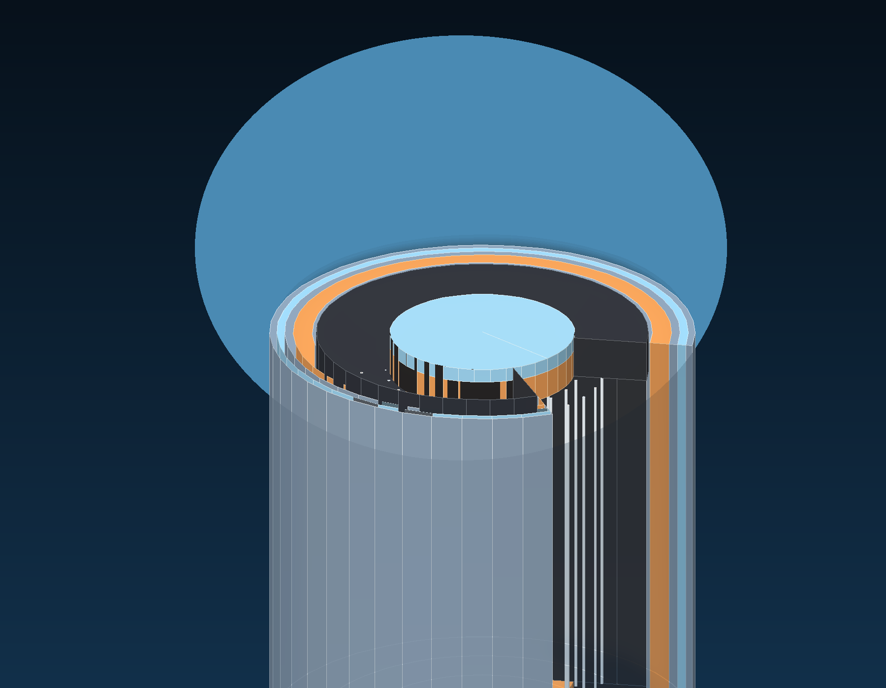

# Thorium Molten Salt Reactor Platform

Python-first reactor design monorepo for a TMSR-LF1-inspired molten salt reactor workflow. The repository starts with OpenMC neutronics, standardizes result bundles, adds a steady-state balance-of-plant model, and emits procedural geometry plus report artifacts while preserving the original 2022 thesis outputs in an in-repo archive.

## Featured Geometry



The `tmsr_lf1_core` case now resolves to a detailed CSG reactor stack with active fuel channels, control-guide channels, instrumentation wells, stacked plena, graphite reflector zones, a downcomer annulus, and dual vessel shells. The same Python geometry definition drives both the OpenMC model build and the repository render artifact.

## What This Repo Now Contains

- `src/thorium_reactor`: installable platform package and `reactor` CLI
- `configs/cases`: canonical reactor cases
- `benchmarks/tmsr_lf1`: surrogate benchmark metadata and assumptions
- `results`: generated result bundles at `results/<case>/<run_id>/`
- `resources`: rendered reference images used in project documentation
- `archive/legacy_openmc_2022`: preserved historical scripts and outputs from the thesis prototype
- `tests`: unit tests for config loading, geometry manifests, BOP closure, and CLI wiring

## Canonical Cases

- `example_pin`: fast smoke/regression case
- `fuel_channel`: layered fuel-channel submodel
- `tmsr_lf1_core`: detailed OpenMC CSG core with vessel stack and specialized channel families inspired by the TMSR-LF1 concept
- `immersed_pool_reference`: reference-inspired immersed-pool concept with offset core enclosure, primary-loop hardware, and animated flow render output

## Environment Setup

Use the provided conda or micromamba environment so OpenMC, analysis dependencies, and the local package are installed in one path.

```bash
micromamba env create -f environment.yml
micromamba activate thorium-reactor
```

On Windows, `environment.yml` creates the base runnable environment for config loading, validation, reporting, geometry export, BOP calculations, and `ffmpeg`-backed animation export. For solver-backed OpenMC runs on a supported host, use `environment-openmc-linux.yml`.

## Docker OpenMC Runtime

For a solver-backed runtime on Docker-capable hosts, the repository includes [docker/openmc-runner.Dockerfile](docker/openmc-runner.Dockerfile) and [docker-compose.openmc.yml](docker-compose.openmc.yml).

```bash
docker compose -f docker-compose.openmc.yml build
docker compose -f docker-compose.openmc.yml run --rm openmc python -m thorium_reactor.cli run example_pin --run-id docker-example
docker compose -f docker-compose.openmc.yml run --rm openmc python -m thorium_reactor.cli report example_pin --run-id docker-example
```

## CLI Workflow

```bash
reactor build example_pin
reactor run example_pin
reactor validate example_pin
reactor report example_pin
reactor render tmsr_lf1_core
reactor transient immersed_pool_reference --scenario partial_heat_sink_loss
reactor moose immersed_pool_reference
reactor scale tmsr_lf1_core
```

Command behavior:

- `reactor build <case>` creates a new result bundle, emits a build manifest, geometry exports, and OpenMC XML if OpenMC is installed.
- `reactor run <case>` performs the build, runs OpenMC when available, computes steady-state BOP outputs, and writes `summary.json` plus `metrics.csv`.
- `reactor validate <case>` checks geometry/material invariants and compares available metrics to configured acceptance bands.
- `reactor report <case>` generates `report.md` from the latest or specified run bundle, including benchmark traceability scorecards when benchmark metadata is present.
- `reactor render <case>` writes procedural geometry exports for visualization workflows, including OBJ, STL, watertight mesh validation JSON, a rendered PNG, animated GIF flow output, and MP4 video output when a case defines flow-animation paths and `ffmpeg` is available.
- `reactor transient <case>` runs a reduced-order nodal transient proxy from the steady-state summary, writes `transient.json`, updates `summary.json`, and emits transient plots when the case defines transient scenarios.
- `reactor moose <case>` exports a MOOSE/Cardinal-oriented proxy input deck from the current case and summary, and can optionally attempt execution with `--run-external`.
- `reactor scale <case>` exports a SCALE-oriented proxy input deck from the current case and summary, and can optionally attempt execution with `--run-external`.

## Result Bundle Contract

Each active run is written to `results/<case>/<run_id>/` and is expected to contain:

- `build_manifest.json`
- `summary.json`
- `metrics.csv`
- `validation.json` after validation
- `report.md` after report generation
- benchmark traceability in `build_manifest.json` and `summary.json` when a case is linked to benchmark metadata
- `openmc/` for solver XML and statepoints
- `geometry/exports/` for SVG, OBJ, STL, watertight mesh validation, rendered PNG, and optional animated GIF or MP4 geometry exports

## Validation Status

The benchmark folder now supports structured evidence, assumptions, target confidence, and traceability scoring, but the current target values are still explicitly labeled surrogate acceptance bands until citation-complete physics validation is added. Tighten those values over time as literature extraction and benchmarking mature.

## Modeling Strategy Notes

- [docs/thermal-hydraulics-modeling-strategy.md](/C:/Users/Admin/Documents/GitHub/Thorium_Molten_Salt_Reactor/docs/thermal-hydraulics-modeling-strategy.md) describes the recommended analysis ladder for this repo: whole-loop reduced-order thermal-hydraulics first, porous or homogenized core models second, and local 3D CFD only where geometry controls the answer. It also lays out the additional precursor-transport and neutronics coupling needed for liquid-fueled MSR studies.
- [docs/current-model-equations.md](/C:/Users/Admin/Documents/GitHub/Thorium_Molten_Salt_Reactor/docs/current-model-equations.md) documents the equations, correlations, supported property units, and OpenMC input assumptions used by the current reduced-order implementation.

## External Solver Hooks

The repository now includes pragmatic integration hooks for MOOSE/Cardinal and SCALE:

- case configs may define `integrations.moose` and `integrations.scale`,
- result bundles capture exported input decks, structured handoff JSON, and execution metadata,
- generated reports surface those integration artifacts under an external integrations section.

These hooks are export/runtime adapters, not full validated model translations. They are meant to give this repo a clean handoff path into external toolchains.
