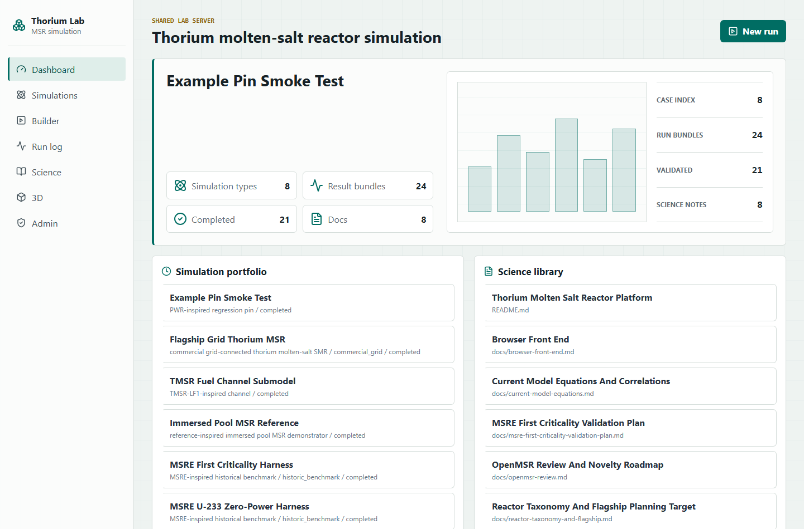
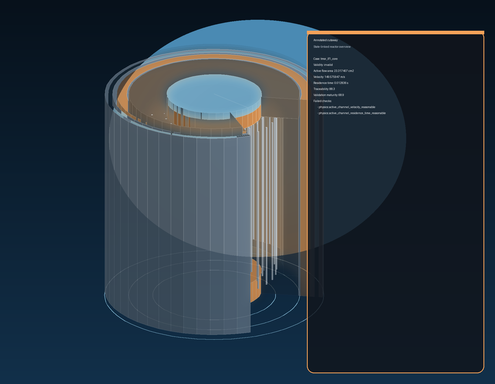
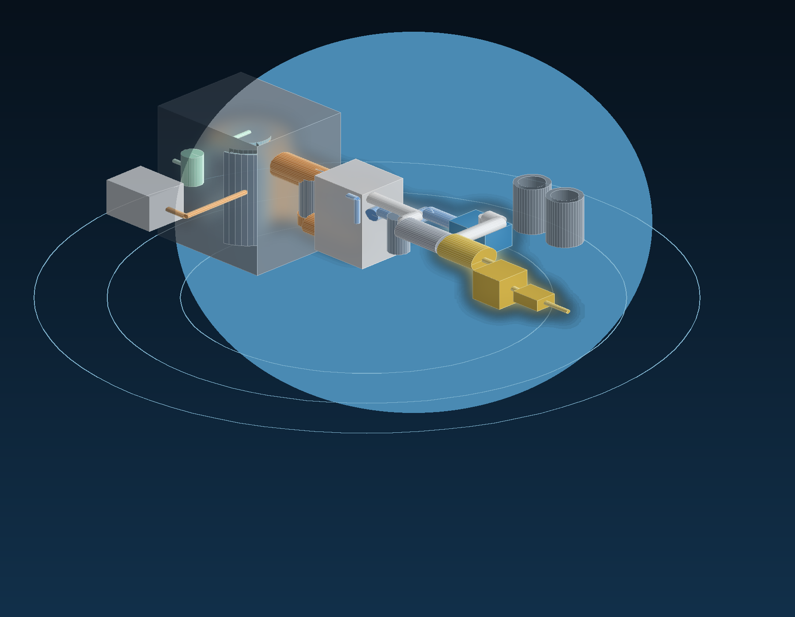
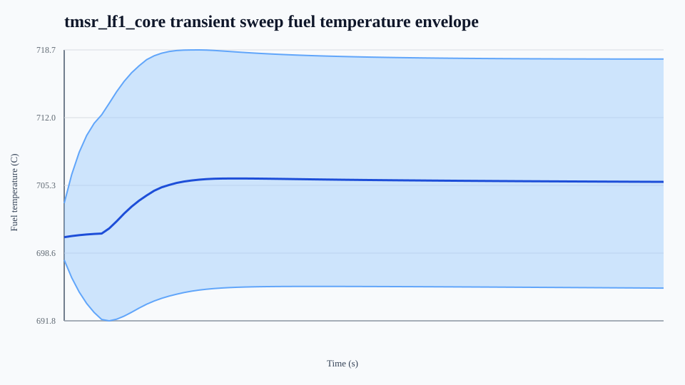
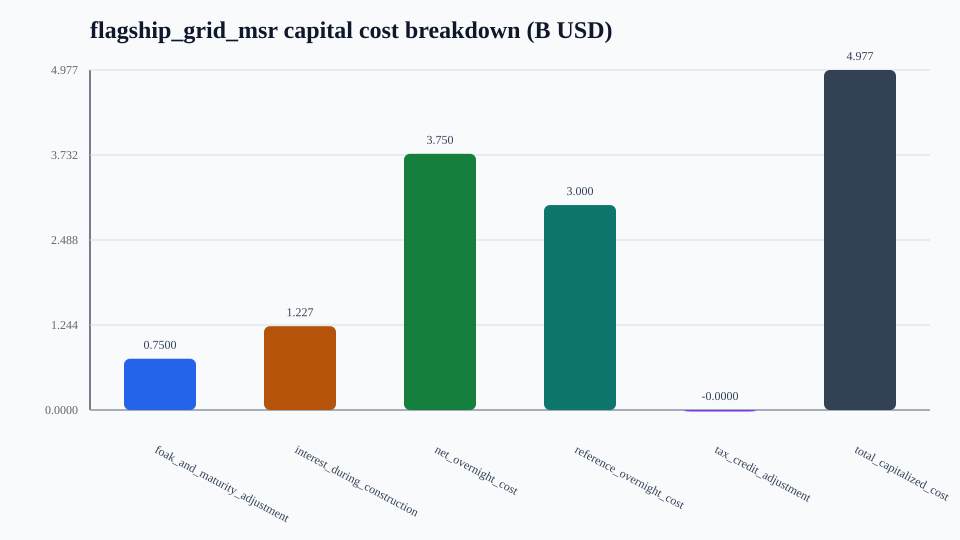
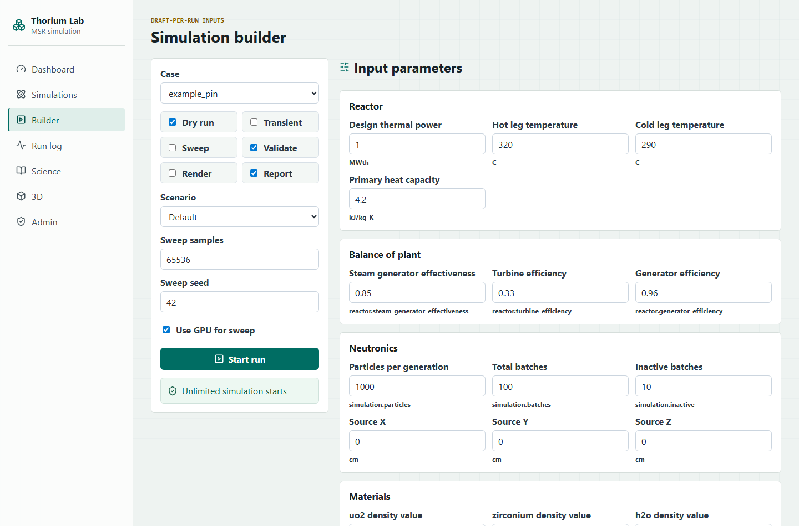

# Thorium Molten Salt Reactor Lab

Config-driven molten-salt reactor simulation workbench with a Python CLI, reproducible result bundles, benchmark traceability, reduced-order thermal/flow models, geometry exports, and a single-port FastAPI + React browser lab.

This is a research and engineering scaffold, not a licensed design tool. The project is deliberately honest about maturity: dry-run neutronics are separated from solver-backed OpenMC work, modern TMSR-style cases are marked as traceable surrogates until deeper source data lands, and generated reports carry validation gaps instead of burying them.



## Start Here

| Goal | Command | Output |
| --- | --- | --- |
| Open a configured shell | `.\scripts\Enter-PytbknShell.cmd` | Repo-aware shell with `PYTHONPATH=src` |
| Build a smoke case | `.\scripts\Run-Reactor.cmd build example_pin` | `results/example_pin/<run_id>/build_manifest.json` |
| Run without OpenMC | `.\scripts\Run-Reactor.cmd run example_pin --no-solver` | Summary, metrics, provenance, report inputs |
| Render the TMSR core | `.\scripts\Run-Reactor.cmd render tmsr_lf1_core` | PNG/SVG/OBJ/STL/glTF geometry exports |
| Start the browser lab | `.\scripts\Run-Web.cmd` | `http://localhost:18488` |
| Run tests | `.\scripts\Run-Tests.cmd` | Full pytest suite |

The Windows `.cmd` wrappers are the normal entrypoints on this host because PowerShell script execution is restricted. See [AGENTS.md](AGENTS.md) for the repo-local runtime rules and [web/README.md](web/README.md) for the browser stack.

## What This Repo Does

| Layer | What is implemented | Where to look |
| --- | --- | --- |
| Case definitions | YAML reactor inputs, material inventories, geometry parameters, transient scenarios, economics assumptions, and validation targets | [configs/cases](configs/cases) |
| Core package | CLI orchestration, config loading, neutronics build plumbing, reduced-order physics, plotting, reporting, web API, and external-code handoffs | [src/thorium_reactor](src/thorium_reactor) |
| Benchmarks | MSRE historical benchmark scaffolds plus TMSR-LF1 literature-backed surrogate targets and traceability scoring | [benchmarks](benchmarks) |
| QA artifacts | Requirements traceability matrix and controlled QA requirement records | [qa](qa) |
| Results | Immutable run bundles under `results/<case>/<run_id>/` with snapshots, metrics, plots, reports, provenance, and geometry exports | [results/README.md](results/README.md) |
| Browser lab | FastAPI serves both `/api` and the production React UI on one port | [web](web) and [docs/browser-front-end.md](docs/browser-front-end.md) |
| Science notes | Modeling equations, literature review, MSRE validation plan, taxonomy, and front-end notes indexed by the Science view | [docs](docs) |
| Legacy work | Preserved 2022 OpenMC thesis prototype and original output files | [archive/legacy_openmc_2022](archive/legacy_openmc_2022) |

## Simulation Figures

The README figures below are durable copies of generated outputs. They live in [resources/readme](resources/readme) because `results/` is intentionally ignored by Git.

| TMSR-LF1 cutaway | Flagship plant render |
| --- | --- |
|  |  |

| Transient uncertainty envelope | Flagship finance waterfall |
| --- | --- |
|  |  |

Figure sources:

| Figure | Source bundle | Context |
| --- | --- | --- |
| TMSR-LF1 cutaway | `results/tmsr_lf1_core/full-suite-20260502-1916-r2/` | 250 MWth traceable surrogate core, 456 generated cells, 91 channels, 85 active-flow salt-bearing channels, `beta_eff = 0.000495`, traceability score 88.3, validation maturity score 68.9 |
| Transient uncertainty envelope | `results/tmsr_lf1_core/full-suite-20260502-1916-r2/` | NumPy backend, 512 samples, p95 fuel-temperature peak 718.7 C for `mild_reactivity_insertion` |
| Flagship plant render | `results/flagship_grid_msr/flagship-plant-schematic/` | Full-plant 3D schematic for the 300 MWe flagship grid thorium MSR planning case |
| Flagship finance waterfall | `results/flagship_grid_msr/full-suite-20260502-1916-r2/` | Commercial planning cost breakdown; planning-grade, not a vendor quote or investment estimate |

## Browser Lab

The app is a practical lab console, not a landing page. It discovers case YAML, reads result bundles, shows generated plots and reports, launches safe workflow phases, and renders Markdown science notes with KaTeX.



Main screens:

| Screen | Purpose |
| --- | --- |
| Dashboard | Portfolio snapshot, latest outputs, documentation index, quick launch |
| Simulations (`/cases`) | Case cards, capabilities, parameters, and latest run context |
| Builder | Draft-per-run YAML parameter edits and safe command selection |
| Runs (`/runs`) | Job status, event stream, reports, plots, raw JSON, and artifacts |
| Science | `README.md` plus `docs/*.md` rendered inside the app |
| 3D viewer | glTF geometry viewer with generated image fallback |
| Admin | Local/deployed run limit reset tools for configured admins |

Browser-launched runs write isolated snapshots under `results/<case>/<run_id>/` and do not mutate `configs/cases/*/case.yaml`. The web command allowlist is intentionally narrow: `build`, `run --no-solver`, `transient`, `transient-sweep`, `validate`, `render`, and `report`.

## Case Portfolio

| Case | Role | Best first command | Notes |
| --- | --- | --- | --- |
| [`example_pin`](configs/cases/example_pin/case.yaml) | Smoke/regression pin | `.\scripts\Run-Reactor.cmd run example_pin --no-solver` | Fastest way to check runtime, reporting, and web bundle display |
| [`fuel_channel`](configs/cases/fuel_channel/case.yaml) | Layered channel submodel | `.\scripts\Run-Reactor.cmd build fuel_channel` | Useful for material and CSG channel checks |
| [`msre_first_criticality`](configs/cases/msre_first_criticality/case.yaml) | Historical benchmark harness | `.\scripts\Run-Reactor.cmd validate msre_first_criticality` | See [MSRE validation plan](docs/msre-first-criticality-validation-plan.md) |
| [`msre_zero_power_physics`](configs/cases/msre_zero_power_physics/case.yaml) | MSRE zero-power regression | `.\scripts\Run-Reactor.cmd report msre_zero_power_physics` | Report and residual plumbing |
| [`msre_u233_zero_power`](configs/cases/msre_u233_zero_power/case.yaml) | U-233 MSRE zero-power harness | `.\scripts\Run-Reactor.cmd validate msre_u233_zero_power` | Historical benchmark path |
| [`tmsr_lf1_core`](configs/cases/tmsr_lf1_core/case.yaml) | Modern TMSR-LF1-inspired core | `.\scripts\Run-Reactor.cmd render tmsr_lf1_core` | Detailed ring-lattice CSG, transient proxy, uncertainty sweep |
| [`immersed_pool_reference`](configs/cases/immersed_pool_reference/case.yaml) | Immersed-pool demonstrator | `.\scripts\Run-Reactor.cmd transient immersed_pool_reference --scenario partial_heat_sink_loss` | Pool layout, loop segments, flow animation assets |
| [`flagship_grid_msr`](configs/cases/flagship_grid_msr/case.yaml) | Commercial planning target | `.\scripts\Run-Reactor.cmd render flagship_grid_msr` | 300 MWe planning case with plant schematic exports; run `.\scripts\Run-Reactor.cmd economics flagship_grid_msr --scenario conservative_foak` for cost and schedule outputs |

More detail lives in [configs/cases/README.md](configs/cases/README.md).

## Result Bundle Contract

Every workflow writes into a run bundle:

```text
results/<case>/<run_id>/
  case_snapshot.yaml
  benchmark_snapshot.yaml
  provenance.json
  build_manifest.json
  geometry_description.json
  summary.json
  metrics.csv
  validation.json
  report.md
  plots/
  geometry/exports/
```

Most commands are additive. `run` creates the core summary; `validate` adds acceptance checks; `report` generates Markdown and plots; `render` adds geometry exports; `transport` adds native R-Z RKDG scalar transport artifacts; `deplete` adds the native sparse depletion matrix; `transient`, `transient-sweep`, `economics`, and external integration commands append their own domain artifacts. The bundle is meant to be inspectable by Git-unaware tools, the CLI, and the browser app.

See [results/README.md](results/README.md) for the full file-by-file contract.

## Runtime Notes

For routine Windows development, use the checked-in wrappers:

```powershell
.\scripts\Run-Reactor.cmd run example_pin --no-solver
.\scripts\Run-Reactor.cmd transport immersed_pool_reference
.\scripts\Run-Reactor.cmd deplete immersed_pool_reference
.\scripts\Run-Reactor.cmd report example_pin
.\scripts\Run-Tests.cmd
```

Interactive work after entering the configured shell:

```powershell
python -m thorium_reactor.cli build example_pin
python -m thorium_reactor.cli run example_pin --no-solver
reactor render tmsr_lf1_core
reactor report example_pin
```

The native transport and depletion commands use NumPy plus SciPy sparse matrix routines when SciPy is installed by the repo-local runtime. OpenMC-backed runs remain a separate solver path. Dry-run workflows are the default Windows path for geometry, reporting, reduced-order flow, and browser-launched runs. Solver-backed OpenMC benchmarks should be run only through the documented OpenMC-capable runtime path.

## Validation Posture

This repository is useful because it exposes uncertainty instead of pretending it is done.

| Area | Current status |
| --- | --- |
| MSRE historical validation | Source dossiers, acceptance bands, assumption logs, and quality gates exist, but the first-criticality case is intentionally not marked benchmark-ready until a source-indexed geometry/material reconstruction and solver-backed bundle are published |
| TMSR-LF1-inspired core | Literature-backed operating point and property-uncertainty context, but still a traceable surrogate rather than a proprietary plant replica |
| Reduced-order transients | Point-kinetics-like proxy with flowing-fuel precursor transport screens, cleanup/depletion placeholders, and uncertainty ensembles |
| Native advanced physics | Additive R-Z SSP-RK3 precursor transport and sparse Bateman depletion artifacts for verification and reporting; not yet a replacement for `physics_core` |
| Geometry exports | Procedural CSG-derived render assets, mesh checks, OBJ/STL/glTF exports, and image overlays |
| Commercial planning | Finance and schedule model for `flagship_grid_msr`, separated from benchmark and research cases |

## Freshness Review

The README was reviewed against the local repository state on 2026-05-19. The main stale item was the old physics overlay figure; it has been replaced with the full flagship plant render above.

| Area | Current status | Needs update when |
| --- | --- | --- |
| README figures | Durable assets now point at current selected source bundles in [resources/README.md](resources/README.md) | A newer accepted result bundle should become the public front-page evidence |
| MSRE first criticality | Still blocked from benchmark-ready language by open geometry, materials, solver-bundle, and cross-code evidence gaps | Source-indexed reconstruction and solver-backed peer-review gates are accepted |
| TMSR-LF1 core | Still a traceable surrogate, not validated plant performance | Source-linked or solver-backed evidence justifies tighter acceptance bands |
| Browser lab docs | Single-port FastAPI + React model still matches the code; route names are listed with labels to avoid nav-name drift | The app adds/removes screens or broadens browser-launchable commands |
| Result bundle summary | Top-level README shows the short contract; [results/README.md](results/README.md) remains the authoritative artifact list | New first-class artifacts become required for every workflow |

Key science references and design reasoning are in:

- [docs/current-model-equations.md](docs/current-model-equations.md)
- [docs/thermal-hydraulics-modeling-strategy.md](docs/thermal-hydraulics-modeling-strategy.md)
- [docs/recent-msr-simulation-literature.md](docs/recent-msr-simulation-literature.md)
- [docs/msre-first-criticality-validation-plan.md](docs/msre-first-criticality-validation-plan.md)
- [docs/reactor-taxonomy-and-flagship.md](docs/reactor-taxonomy-and-flagship.md)
- [docs/openmsr-review.md](docs/openmsr-review.md)

## External Tool Hooks

The CLI can export integration inputs and handoff metadata for MOOSE/Cardinal-style workflows, SCALE, Thermochimica, SaltProc, and Moltres:

```powershell
.\scripts\Run-Reactor.cmd moose immersed_pool_reference
.\scripts\Run-Reactor.cmd scale tmsr_lf1_core
.\scripts\Run-Reactor.cmd thermochimica tmsr_lf1_core
.\scripts\Run-Reactor.cmd saltproc tmsr_lf1_core
.\scripts\Run-Reactor.cmd moltres immersed_pool_reference
```

These are pragmatic export adapters. They do not claim validated one-to-one translations into those external codes.

## Development Links

- [AGENTS.md](AGENTS.md): local runtime and workflow rules
- [configs/cases/README.md](configs/cases/README.md): case schema and portfolio details
- [src/thorium_reactor/README.md](src/thorium_reactor/README.md): package map and command flow
- [qa/README.md](qa/README.md): requirements traceability and QA record artifacts
- [web/README.md](web/README.md): browser app architecture and operational notes
- [benchmarks/README.md](benchmarks/README.md): benchmark evidence structure
- [results/README.md](results/README.md): bundle anatomy
- [resources/README.md](resources/README.md): README figure refresh notes
- [experiments/gpu_viability/README.md](experiments/gpu_viability/README.md): GPU viability experiments
- [archive/legacy_openmc_2022/README.md](archive/legacy_openmc_2022/README.md): preserved legacy prototype

## License

MIT. See [LICENSE](LICENSE).
